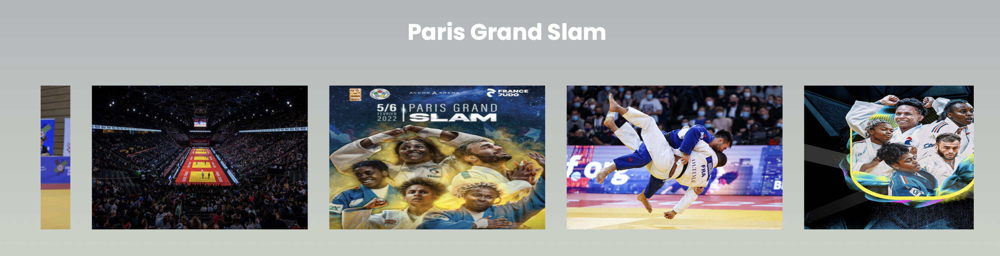

# French-Project-Based-Learning
 This is my second semester French PBL website about the introduction of French Sports

## Working Application

Check Out the Live Version -> [French-PBL](https://rohitsaraf.store/)

## Screenshots

## Support

If you like my work, feel free to:
 - ⭐ this Repository. And we will live happily ever after xD.
 - Join me on Social: 
 - [][instagram] 
 [][linkedin]

Thanks a Bunch for Stopping By! <3

[instagram]: https://www.instagram.com/rohit_kumarrrrr_/
[linkedin]: https://www.linkedin.com/in/rohit-kumar-28aa94223/

## Tech Stack
Front-End

 

## Credits & References

| Resource                                                               | Description                                                                                                           |
| ---------------------------------------------------------------------- | --------------------------------------------------------------------------------------------------------------------- |
| [ImKennyYip][ImKennyYip]                                                     | A cool 2048 game made by [ImKennyYip], I reused the Javascript for this Project with some of my customization, |
| [2048][2048] | I refer to this original game by Gabriele Cirulli for the UI.                                                |

[ImKennyYip]: https://github.com/ImKennyYip/2048
[2048]: https://play2048.co/

## License

[MIT](https://github.com/BasimAhmedKhan/2048-Game/blob/main/LICENSE)
